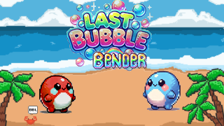

# GGJ2025.

This is our attempt to develop a game in 48 hours as part of this year's Global Game Jam. We were prompted to stick with the theme: "Bubbles".

<div align="center">
  
</div>

## Last Bubble Bender 🫧

Last Bubble Bender is a high-energy, local-multiplayer arcade game where two mischievous bubble monsters face off in a battle of bouncy bubbles and clever strategy! Armed with the power to blow bubbles that bounce unpredictably around the arena, you’ll need to outwit your opponent and become the ultimate bubble bender.

<div align="center">
  
</div>

## Build and Run

```
cd ggj2025
./run.sh
```

## Credits

* [m4mbo](https://github.com/m4mbo)
* [prosk-sudo](https://github.com/prosk-sudo)
* [kamepe](https://github.com/kamepe)
* [MuAzi04](https://github.com/MuAzi04) 
* [Inderjot01](https://github.com/Inderjot01)
* [AXTNVETN](https://github.com/AXTNVETN)
* [Mkhaled4](https://github.com/Mkhaled4)

<div align="center">
  
  
</div>
